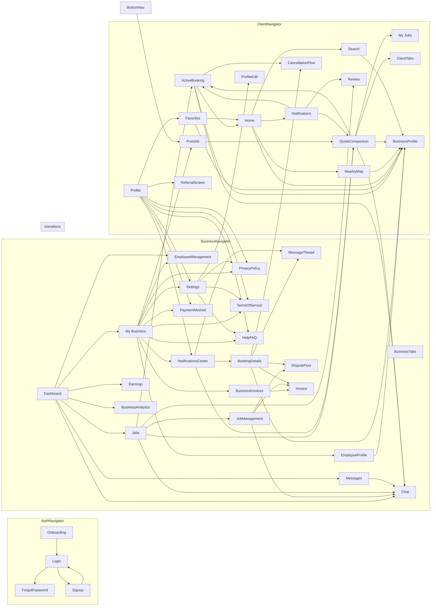

# SwingBy — Code Flow Graph

_Generated by `tools/flow_graph.py`. Regenerate any time._

## Navigation graph

Orphans (unreachable in their navigator) are highlighted in red.

## Broken navigation edges

Screens that call `navigation.navigate('X')` where **X is not registered** in any navigator.

*None.* Every navigation target resolves.

## Orphan screens (global)

Registered screens with **no incoming navigation from anywhere** (excluding navigator roots).

*None.* Every screen is reachable somewhere.

## Orphan screens (per-navigator)

Screens that ARE registered in a navigator but **cannot be reached by that user role's flow**. A screen may be reachable from ClientNavigator yet still be unreachable to a Business user, and vice-versa.

*None.* Every screen is reachable from within its own navigator.

## Broken API calls

Mobile calls to endpoints **not exposed by the backend** (path params normalized).

*None.* Every API call resolves.

## Inventory

- Navigators: **4**  
- Registered screens: **55**  
- Navigation edges: **85**  
- Backend routes: **72**  
- Mobile API calls: **76**  
