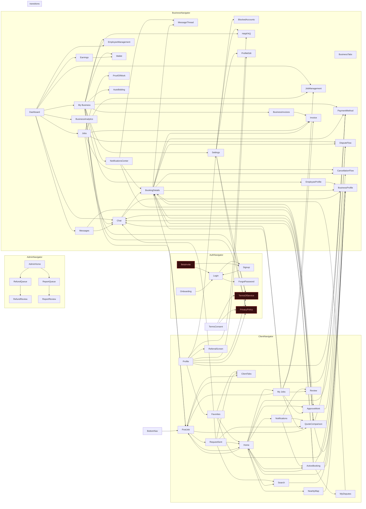

# SwingBy — Code Flow Graph

_Generated by `tools/flow_graph.py`. Regenerate any time._

## Navigation graph

Orphans (unreachable in their navigator) are highlighted in red.

```mermaid
flowchart LR
  classDef orphan fill:#3a0f0f,stroke:#ff5c5c,color:#ffb3b3;
  subgraph AdminNavigator
    AdminHome["AdminHome"]
    RefundQueue["RefundQueue"]
    RefundReview["RefundReview"]
    ReportQueue["ReportQueue"]
    ReportReview["ReportReview"]
  end
  subgraph AuthNavigator
    Onboarding["Onboarding"]
    BetaInvite["BetaInvite"]
    Login["Login"]
    Signup["Signup"]
    ForgotPassword["ForgotPassword"]
    TermsOfService["TermsOfService"]
    PrivacyPolicy["PrivacyPolicy"]
  end
  subgraph BusinessNavigator
    Dashboard["Dashboard"]
    Jobs["Jobs"]
    Messages["Messages"]
    My_Business["My Business"]
    BusinessTabs["BusinessTabs"]
    JobManagement["JobManagement"]
    Chat["Chat"]
    EmployeeManagement["EmployeeManagement"]
    EmployeeProfile["EmployeeProfile"]
    Earnings["Earnings"]
    Wallet["Wallet"]
    BusinessAnalytics["BusinessAnalytics"]
    Settings["Settings"]
    BlockedAccounts["BlockedAccounts"]
    PrivacyPolicy["PrivacyPolicy"]
    TermsOfService["TermsOfService"]
    HelpFAQ["HelpFAQ"]
    NotificationsCenter["NotificationsCenter"]
    BookingDetails["BookingDetails"]
    MessageThread["MessageThread"]
    PaymentMethod["PaymentMethod"]
    DisputeFlow["DisputeFlow"]
    CancellationFlow["CancellationFlow"]
    Invoice["Invoice"]
    BusinessInvoices["BusinessInvoices"]
    ProofOfWork["ProofOfWork"]
    AutoBidding["AutoBidding"]
    ProfileEdit["ProfileEdit"]
    BusinessProfile["BusinessProfile"]
  end
  subgraph ClientNavigator
    Home["Home"]
    My_Jobs["My Jobs"]
    Messages["Messages"]
    Profile["Profile"]
    ClientTabs["ClientTabs"]
    BusinessProfile["BusinessProfile"]
    EmployeeProfile["EmployeeProfile"]
    ActiveBooking["ActiveBooking"]
    QuoteComparison["QuoteComparison"]
    PostJob["PostJob"]
    Chat["Chat"]
    Review["Review"]
    Notifications["Notifications"]
    Search["Search"]
    Favorites["Favorites"]
    NearbyMap["NearbyMap"]
    ProfileEdit["ProfileEdit"]
    Settings["Settings"]
    BlockedAccounts["BlockedAccounts"]
    PrivacyPolicy["PrivacyPolicy"]
    TermsOfService["TermsOfService"]
    HelpFAQ["HelpFAQ"]
    ReferralScreen["ReferralScreen"]
    NotificationsCenter["NotificationsCenter"]
    BookingDetails["BookingDetails"]
    MessageThread["MessageThread"]
    CancellationFlow["CancellationFlow"]
    PaymentMethod["PaymentMethod"]
    DisputeFlow["DisputeFlow"]
    Invoice["Invoice"]
    MyDisputes["MyDisputes"]
    RequestSent["RequestSent"]
    ApproveWork["ApproveWork"]
  end
  subgraph transitions
  end
  Signup --> Login
  Login --> ForgotPassword
  Login --> Signup
  BetaInvite --> Signup
  BetaInvite --> Login
  Onboarding --> Login
  Settings --> ProfileEdit
  Settings --> BlockedAccounts
  Settings --> PrivacyPolicy
  Settings --> TermsOfService
  Settings --> HelpFAQ
  RefundQueue --> RefundReview
  AdminHome --> RefundQueue
  AdminHome --> ReportQueue
  ReportQueue --> ReportReview
  Profile --> ProfileEdit
  Profile --> Favorites
  Profile --> PaymentMethod
  Profile --> ReferralScreen
  Profile --> Settings
  Profile --> HelpFAQ
  Profile --> PrivacyPolicy
  Profile --> TermsOfService
  Notifications --> ActiveBooking
  Notifications --> Review
  Notifications --> QuoteComparison
  NotificationsCenter --> QuoteComparison
  NotificationsCenter --> MessageThread
  NotificationsCenter --> BookingDetails
  My_Business --> EmployeeManagement
  My_Business --> Wallet
  My_Business --> PaymentMethod
  My_Business --> BusinessInvoices
  My_Business --> AutoBidding
  My_Business --> NotificationsCenter
  My_Business --> Settings
  My_Business --> HelpFAQ
  My_Business --> PrivacyPolicy
  My_Business --> TermsOfService
  My_Business --> EmployeeProfile
  My_Business --> PostJob
  Dashboard --> Jobs
  Dashboard --> Messages
  Dashboard --> My_Business
  Dashboard --> JobManagement
  Dashboard --> BusinessAnalytics
  Dashboard --> Earnings
  Dashboard --> EmployeeManagement
  Dashboard --> Chat
  BusinessInvoices --> Invoice
  EmployeeProfile --> BusinessProfile
  Jobs --> Chat
  Jobs --> ProofOfWork
  Jobs --> Invoice
  Jobs --> DisputeFlow
  Jobs --> CancellationFlow
  Jobs --> JobManagement
  Earnings --> Wallet
  Favorites --> ClientTabs
  Favorites --> Home
  Favorites --> BusinessProfile
  MyDisputes --> BookingDetails
  ActiveBooking --> Home
  ActiveBooking --> BusinessProfile
  ActiveBooking --> Chat
  ActiveBooking --> BookingDetails
  ActiveBooking --> MyDisputes
  ActiveBooking --> CancellationFlow
  RequestSent --> ClientTabs
  RequestSent --> Home
  RequestSent --> Chat
  RequestSent --> QuoteComparison
  RequestSent --> Search
  Home --> PostJob
  Home --> ActiveBooking
  Home --> My_Jobs
  Home --> Notifications
  Home --> DisputeFlow
  Home --> ApproveWork
  Home --> Search
  Home --> NearbyMap
  Home --> BusinessProfile
  My_Jobs --> JobManagement
  My_Jobs --> QuoteComparison
  My_Jobs --> Chat
  My_Jobs --> BookingDetails
  My_Jobs --> ApproveWork
  My_Jobs --> Invoice
  My_Jobs --> PostJob
  My_Jobs --> Review
  Search --> BusinessProfile
  ApproveWork --> DisputeFlow
  QuoteComparison --> Chat
  QuoteComparison --> BookingDetails
  QuoteComparison --> BusinessProfile
  QuoteComparison --> PaymentMethod
  NearbyMap --> BusinessProfile
  PostJob --> ClientTabs
  PostJob --> RequestSent
  PostJob --> Home
  PostJob --> QuoteComparison
  PostJob --> PaymentMethod
  BookingDetails --> MessageThread
  BookingDetails --> CancellationFlow
  BookingDetails --> PostJob
  BookingDetails --> ApproveWork
  BookingDetails --> Invoice
  BookingDetails --> DisputeFlow
  BookingDetails --> BusinessProfile
  BookingDetails --> PaymentMethod
  Chat --> BusinessProfile
  Chat --> BookingDetails
  Messages --> Chat
  Messages --> QuoteComparison
  BottomNav --> PostJob
  TermsConsent --> TermsOfService
  TermsConsent --> PrivacyPolicy
  class BetaInvite orphan;
  class PrivacyPolicy orphan;
  class TermsOfService orphan;
```

## Broken navigation edges

Screens that call `navigation.navigate('X')` where **X is not registered** in any navigator.

*None.* Every navigation target resolves.

## Orphan screens (global)

Registered screens with **no incoming navigation from anywhere** (excluding navigator roots).

- `BetaInvite`

## Orphan screens (per-navigator)

Screens that ARE registered in a navigator but **cannot be reached by that user role's flow**. A screen may be reachable from ClientNavigator yet still be unreachable to a Business user, and vice-versa.

### `AuthNavigator`

- `BetaInvite`
- `PrivacyPolicy`
- `TermsOfService`

## Broken API calls

Mobile calls to endpoints **not exposed by the backend** (path params normalized).

| From file:line | Method | Path (raw) | Normalized |
|---|---|---|---|
| `mobile/src/services/__mocks__/api.js:14` | GET | `/x` | `/x` |

## Inventory

- Navigators: **5**  
- Registered screens: **74**  
- Navigation edges: **145**  
- Backend routes: **140**  
- Mobile API calls: **155**  
