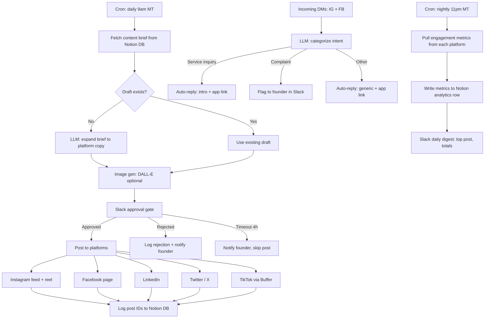

# 11 — n8n Social Media Workflow

> Automated social posting, DM routing, and analytics — built on n8n.

---

## Why n8n

n8n is open-source workflow automation. You can self-host it for $0/month or use n8n Cloud at $20/month. Every node in the workflow is visible, auditable, and editable — no black box. The workflow described here replaces 5-6 hours of weekly manual posting.

This document tells you what to build. The importable JSON is at [`workflows/n8n-social-media-workflow.json`](workflows/n8n-social-media-workflow.json). The import guide is at [`workflows/README.md`](workflows/README.md).

---

## Architecture overview



---

## Nodes required

### 1. Cron trigger — daily 9am Mountain Time

**Node type:** `n8n-nodes-base.cron`

Fires once a day at 09:00 America/Edmonton. This is the entry point for the daily posting workflow. Do not fire on days when no content brief exists — the Notion fetch node handles that check.

**Settings:**
- Mode: Custom (CRON expression)
- Expression: `0 9 * * *`
- Timezone: America/Edmonton

---

### 2. Content source — Notion database

**Node type:** `n8n-nodes-base.notion`
**Operation:** Get database items (filtered to `status = "ready"`)

Your Notion content DB has one row per piece of content. Columns:

| Column | Type | Purpose |
|---|---|---|
| Title | Text | The post idea / headline |
| Platform | Multi-select | Instagram, LinkedIn, Twitter, Facebook, TikTok |
| Content brief | Text | 1-3 sentences describing the post idea |
| Caption draft | Text | Optional — skip LLM if already written |
| Image URL | URL | Optional — skip image gen if already provided |
| Status | Select | draft / ready / approved / posted |
| Scheduled date | Date | The day this should go out |
| Post IDs | Text | Written back after publishing |

**Filter:** Scheduled date = today AND Status = "ready"

If the filter returns zero rows, the workflow ends with a Slack message: "No content scheduled for today."

---

### 3. LLM node — expand brief to platform copy

**Node type:** `n8n-nodes-base.openAi` (or `n8n-nodes-base.anthropic` if using Claude)

Use this node when `Caption draft` is empty. It takes the content brief and expands it into platform-specific copy.

**System prompt:**
```
You are a social media copywriter for SwingBy, a Calgary-based service marketplace. 
SwingBy connects clients with local service businesses (cleaning, handyman, pet care, moving, etc.).
Voice: direct, warm, confident. Short sentences. No jargon. No "unlock," "leverage," or "ecosystem."
Calgary-specific where possible. Always end with a soft call to action or question.
```

**User prompt (per platform):**
```
Content brief: {{$json["Content brief"]}}
Platform: {{$json["Platform"]}}

Write a caption for this platform. Follow platform conventions:
- Instagram: 100-150 words, 5-10 hashtags at the end, emoji allowed
- LinkedIn: 120-200 words, no hashtags, professional but personal
- Twitter/X: under 280 characters, punchy, optionally start a thread
- Facebook: 80-120 words, conversational, local focus
- TikTok: just a caption text, 3-5 hashtags, short

Return JSON: {"instagram": "...", "linkedin": "...", "twitter": "...", "facebook": "...", "tiktok": "..."}
```

**Temperature:** 0.7 — enough variety but not random.

---

### 4. Image generation node — DALL-E (optional)

**Node type:** `n8n-nodes-base.openAi` (Images endpoint)

Only runs when no Image URL is provided in the Notion row. For most posts, use pre-made Canva graphics — save DALL-E for on-the-fly illustrations.

**Prompt template:**
```
{{$json["Title"]}} — professional lifestyle photography style, Calgary city backdrop, warm natural lighting, no text in image, suitable for Instagram.
```

**Size:** 1024×1024. Download the URL and upload to your CDN or S3 bucket before posting.

> TODO (HUMAN): Set up an S3 bucket or Cloudflare R2 bucket for image hosting. The image URL from DALL-E expires after 60 minutes, so download and re-host it.

---

### 5. Approval gate — Slack / Telegram bot

**Node type:** `n8n-nodes-base.slack` (send) + `n8n-nodes-base.webhook` (receive approval)

Send a Slack message with the draft caption and image to the `#content-approvals` channel. Include two buttons: "Approve" and "Reject."

**Slack message format:**
```
*Content ready for approval*
Platform: {{platforms}}
Caption: {{caption_preview}}
Image: {{image_url}}

[Approve] [Reject]
```

**Approval flow:**
- If "Approve" clicked → proceed to posting nodes
- If "Reject" clicked → log rejection reason, mark Notion row as "rejected," notify founder
- If no response after 4 hours → skip today's post, send "No approval received" Slack message, leave Notion row as "ready" for tomorrow

**Implementation:** Use an n8n webhook URL as the Slack interactive callback URL. In Slack App settings → Interactivity → set the Request URL to your n8n webhook.

---

### 6. Platform poster nodes

Each platform is a separate HTTP request or platform-specific node. Run them in parallel after approval.

#### Instagram + Facebook (Meta Graph API)

**Node type:** `n8n-nodes-base.httpRequest`

1. Upload image to Instagram media endpoint:
   `POST https://graph.facebook.com/v19.0/{ig-user-id}/media`
   Body: `{"image_url": "...", "caption": "...", "access_token": "..."}`

2. Publish the media container:
   `POST https://graph.facebook.com/v19.0/{ig-user-id}/media_publish`
   Body: `{"creation_id": "...", "access_token": "..."}`

3. For Facebook page, use:
   `POST https://graph.facebook.com/v19.0/{page-id}/photos`

**Rate limits:** Instagram allows 25 posts per 24 hours. We post once daily — well under.

#### LinkedIn

**Node type:** `n8n-nodes-base.linkedIn`

Use the LinkedIn node to post to both the company page and optionally tag the founder's personal profile.

**Operation:** Create post  
**Profile:** Company page ID (get from LinkedIn company admin panel)  
**Content:** LinkedIn caption from LLM output

#### Twitter / X

**Node type:** `n8n-nodes-base.twitter`

**Operation:** Create tweet  
**Text:** Twitter caption (≤280 chars)  
**Media:** Upload image first via media/upload endpoint, then attach media_id

#### TikTok — Buffer fallback

TikTok's API requires business account approval and is limited. Use Buffer as a bridge.

**Node type:** `n8n-nodes-base.httpRequest`  
**URL:** `https://api.bufferapp.com/1/updates/create.json`  
**Method:** POST  
**Body:** profile_ids (TikTok profile), text (TikTok caption), media (image)

Buffer will queue the TikTok post for the scheduled time. You still need to manually confirm video posts in the Buffer interface (TikTok requires a mobile app confirm step for video).

---

### 7. DM auto-reply node

**Node type:** `n8n-nodes-base.webhook` (receive) + `n8n-nodes-base.openAi` (classify) + `n8n-nodes-base.httpRequest` (reply)

Set up a Meta webhook subscription for `messages` on your Instagram Business account and Facebook page.

**Classification prompt:**
```
Classify this DM into one of: "service_inquiry", "complaint", "compliment", "spam", "other".
DM: {{$json["message"]}}
Return JSON: {"category": "...", "summary": "..."}
```

**Auto-replies by category:**

| Category | Reply |
|---|---|
| service_inquiry | "Thanks for reaching out! To get started, download SwingBy at [app link]. Post your job and businesses will come to you. Questions? Reply here." |
| complaint | [Flag to Slack, do not auto-reply] |
| compliment | "That means a lot — thank you! If you haven't already, leave a review in the app. It helps businesses grow." |
| spam | [No reply, mark as seen] |
| other | "Hi! We read every message but get a lot of DMs. For the fastest help, visit swingby.ca or use the app." |

---

### 8. Edit / repost node

A manual trigger that accepts: `post_id`, `platform`, `new_caption`. It deletes the original post (if the platform API allows) and reposts with the corrected copy. Instagram and TikTok do not allow editing captions after publishing — deletion + repost is the only option.

**Node type:** `n8n-nodes-base.manualTrigger` → `n8n-nodes-base.httpRequest` (delete) → posting nodes

---

### 9. Analytics collector — nightly cron

**Node type:** `n8n-nodes-base.cron` (11pm MT) → fetch metrics → write to Notion

Pull engagement metrics from each platform's API:

| Platform | Metrics to pull | API endpoint |
|---|---|---|
| Instagram | likes, comments, shares, reach, impressions | `GET /{media-id}/insights` |
| Facebook | likes, comments, shares, reach | `GET /{post-id}?fields=likes.summary,comments.summary,shares` |
| LinkedIn | impressions, clicks, likes, comments | `GET /organizationalEntityShareStatistics` |
| Twitter/X | impressions, likes, retweets, replies | `GET /tweets/{id}?tweet.fields=public_metrics` |

Write each row back to the Notion DB: `Post IDs` → match → update `Metrics` column.

Send a nightly Slack digest: top-performing post of the day + weekly totals.

---

## Workflow setup steps

### Step 1 — Set up n8n

Option A (recommended for control): Self-host on a $6/month Hetzner or DigitalOcean VPS.
```
docker run -it --rm --name n8n -p 5678:5678 -v ~/.n8n:/home/node/.n8n n8nio/n8n
```

Option B (easier start): n8n Cloud at cloud.n8n.io — $20/month, no server management.

### Step 2 — Create Notion content database

1. Create a new Notion page. Add a full-page database.
2. Add all columns listed in node 2 above.
3. Create at least one test row with Status = "ready" and today's date.
4. In Notion settings → Integrations → create a new integration, copy the API token.

### Step 3 — Set up Meta developer app

1. Go to developers.facebook.com → Create App → Business type.
2. Add products: Instagram Graph API, Facebook Pages API, Webhooks.
3. Generate a long-lived Page Access Token (valid 60 days — refresh before expiry).
4. Set webhook subscriptions: messages, mentions.

### Step 4 — Set up Twitter / X developer app

1. Apply for Twitter Developer Portal access at developer.twitter.com.
2. Create a project + app. Enable OAuth 2.0 with read and write permissions.
3. Generate access token + secret.

### Step 5 — Set up LinkedIn app

1. Go to linkedin.com/developers → Create App.
2. Request `w_member_social` and `r_organization_social` permissions.
3. Link to your company page.
4. Generate OAuth 2.0 access token.

### Step 6 — Set up Slack app

1. Create a Slack app at api.slack.com/apps.
2. Add permissions: `chat:write`, `incoming-webhook`.
3. Enable Interactivity and set the Request URL to your n8n webhook.
4. Install to workspace, copy the Bot User OAuth Token.

### Step 7 — Configure n8n credentials

In n8n → Credentials → Add:
- **Notion:** paste API token
- **OpenAI:** paste API key
- **Slack:** paste Bot Token
- **Twitter / X:** paste API key + secret + access token + secret
- **LinkedIn:** paste Client ID + secret + access token
- **Buffer:** paste access token (if using for TikTok)

Never put these keys directly in the workflow JSON. Always reference the credential by name.

### Step 8 — Import the workflow

Follow instructions in [`workflows/README.md`](workflows/README.md).

### Step 9 — Test before going live

1. Create a test Notion row with Status = "ready" and today's date.
2. Manually trigger the workflow in n8n.
3. Verify the Slack approval message arrives.
4. Click "Approve."
5. Verify the post appears on each platform.
6. Check the Notion row is updated with post IDs.

---

## Required API credentials

| Credential | Where to get it | Expires |
|---|---|---|
| Notion integration token | developers.notion.com | Never |
| OpenAI API key | platform.openai.com | Never (revoke if leaked) |
| Meta Page Access Token | developers.facebook.com → Graph API Explorer | 60 days — set a calendar reminder |
| Twitter API key + secret | developer.twitter.com | Never |
| Twitter access token | developer.twitter.com | Never |
| LinkedIn access token | developer.linkedin.com | 60 days |
| Slack Bot Token | api.slack.com/apps | Never |
| Buffer access token | buffer.com/developers | Never |

Store all tokens in n8n Credentials. Do not store them in the workflow JSON or in any file committed to git.

---

## Cost estimate per month

| Item | Cost |
|---|---|
| n8n self-hosted (Hetzner VPS) | $6-12 |
| n8n Cloud (alternative) | $20 |
| OpenAI API (GPT-4o, 30 posts/month, ~800 tokens each) | ~$3 |
| DALL-E (if generating 10 images/month) | ~$2 |
| Buffer (for TikTok scheduling) | $15 (Essentials plan) |
| Meta, Twitter, LinkedIn APIs | Free |
| **Total (self-hosted)** | **~$26/month** |
| **Total (n8n Cloud)** | **~$40/month** |

For comparison, a social media manager posting manually costs $500-2000/month.

---

## Failure modes and fallbacks

| Failure | What happens | Fallback |
|---|---|---|
| Notion fetch returns 0 rows | Workflow ends gracefully | Slack message: "No content today" |
| OpenAI API down | Retry 3×, then Slack alert | Post manually from Notion draft |
| Meta API rate-limited (25 posts/day) | Error caught, Slack alert | Post from mobile app manually |
| Slack approval times out (4h) | Post skipped, row stays "ready" | Will retry tomorrow if date not updated |
| LinkedIn token expires | Posting fails, Slack alert | Refresh token at developers.linkedin.com |
| DALL-E image URL expires | Repost with fallback image | Keep a folder of 20 generic brand images as fallbacks |
| n8n server goes down (self-hosted) | All automations stop | Use n8n Cloud as backup; monitor uptime with UptimeRobot |

---

## Cross-links

- [07-content-calendar.md](07-content-calendar.md) — weekly content themes and cadence
- [12-social-media-playbook.md](12-social-media-playbook.md) — manual engagement guide
- [09-brand-guidelines.md](09-brand-guidelines.md) — voice, tone, visual standards
- [`workflows/n8n-social-media-workflow.json`](workflows/n8n-social-media-workflow.json) — importable JSON
- [`workflows/README.md`](workflows/README.md) — setup guide
