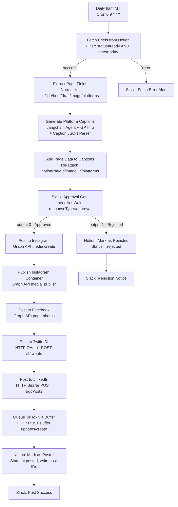
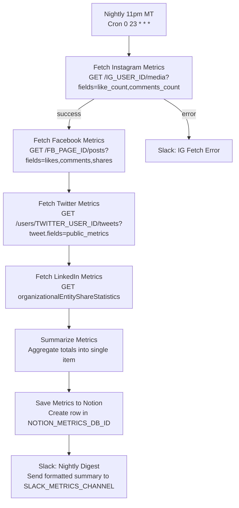
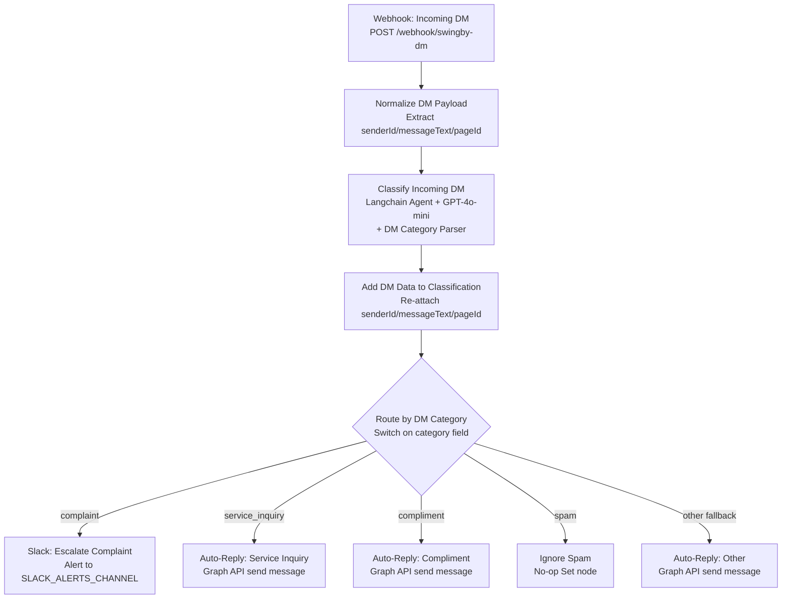

# 11 — n8n Social Media Workflow

> Automated social posting, DM routing, and engagement analytics — built on n8n.

---

## Why n8n

n8n is open-source workflow automation. Self-host for $0/month or use n8n Cloud at $20/month. Every node is visible, auditable, and editable. The three workflows here replace 5-6 hours of weekly manual work: daily posting, nightly metric collection, and DM triage.

**n8n instance:** https://alkubati.app.n8n.cloud

---

## Workflows — as built

| Workflow | ID | Trigger | Nodes | JSON file |
|---|---|---|---|---|
| SwingBy — Daily social publishing | `SQIBLuX7eM6lfaIa` | Cron 09:00 MT daily | 20 | `workflows/n8n-social-media-workflow.json` |
| SwingBy — Engagement collector | `Um8k8RKKLPJb0EWb` | Cron 23:00 MT daily | 10 | `workflows/n8n-engagement-collector.json` |
| SwingBy — DM auto-reply | `qznSX1fO2DqOmWAz` | Webhook POST /swingby-dm | 13 | `workflows/n8n-dm-auto-reply.json` |

All workflows use placeholder credentials. Activate only after completing Phase 2 setup.

---

## Workflow 1 — Daily social publishing

### Mermaid diagram

### Node-by-node table

| Node | Type | Purpose | Credentials needed |
|---|---|---|---|
| Daily 9am MT | scheduleTrigger | Fires at 09:00 America/Edmonton (`0 9 * * *`) | None |
| Fetch Briefs from Notion | notion databasePage getAll | Pulls rows where Status=ready AND Scheduled date=today from `$vars.NOTION_CONTENT_DB_ID` | `swingby-notion-cred` |
| Slack: Fetch Error Alert | slack message post | Alerts `$vars.SLACK_ALERTS_CHANNEL` if Notion fetch fails | `swingby-slack-cred` |
| Extract Page Fields | set | Normalizes page id, title, brief, draft, imageUrl, platforms | None |
| Generate Platform Captions | langchain agent (GPT-4o) | Writes platform-specific captions from brief; outputs structured JSON | `swingby-openai-cred` |
| OpenAI GPT Model | lmChatOpenAi | Model subnode: gpt-4o, temp 0.7, max 2000 tokens | `swingby-openai-cred` |
| Caption JSON Parser | outputParserStructured | Enforces JSON schema `{instagram, linkedin, twitter, facebook, tiktok}` | None |
| Add Page Data to Captions | set (includeOtherFields) | Re-attaches notionPageId, postTitle, imageUrl, platforms after agent output | None |
| Slack: Approval Gate | slack sendAndWait approval | Posts preview to `$vars.SLACK_APPROVAL_CHANNEL`; blocks until Approve/Reject clicked | `swingby-slack-cred` |
| Post to Instagram | httpRequest | Graph API v19.0: creates IG media container | `$vars.META_ACCESS_TOKEN` via env |
| Publish Instagram Container | httpRequest | Graph API v19.0: publishes IG media container | `$vars.META_ACCESS_TOKEN` via env |
| Post to Facebook | httpRequest | Graph API v19.0: posts photo to FB page | `$vars.META_ACCESS_TOKEN` via env |
| Post to Twitter/X | httpRequest OAuth1 | Twitter API v2: POST /2/tweets | OAuth1 credential wired at node |
| Post to LinkedIn | httpRequest Bearer | LinkedIn UGC Posts API: publishes to org page | `$vars.LI_ACCESS_TOKEN` + `$vars.LI_ORG_ID` |
| Queue TikTok via Buffer | httpRequest Bearer | Buffer API: queues post to TikTok profile | `$vars.BUFFER_ACCESS_TOKEN` |
| Notion: Mark as Posted | notion databasePage update | Sets Status=posted, Posted at=now, writes post IDs | `swingby-notion-cred` |
| Slack: Post Success | slack message post | Confirms success in approval channel | `swingby-slack-cred` |
| Notion: Mark as Rejected | notion databasePage update | Sets Status=rejected | `swingby-notion-cred` |
| Slack: Rejection Notice | slack message post | Notifies founder post was rejected | `swingby-slack-cred` |

---

## Workflow 2 — Engagement collector

### Mermaid diagram

### Node-by-node table

| Node | Type | Purpose | Credentials needed |
|---|---|---|---|
| Nightly 11pm MT | scheduleTrigger | Fires at 23:00 America/Edmonton (`0 23 * * *`) | None |
| Fetch Instagram Metrics | httpRequest GET | Recent media with like_count + comments_count (last 5 posts) | `$vars.META_ACCESS_TOKEN` |
| Slack: IG Fetch Error | slack message post | Error path: alerts if IG fetch fails | `swingby-slack-cred` |
| Fetch Facebook Metrics | httpRequest GET | Page posts with likes/comments/shares summary | `$vars.META_ACCESS_TOKEN` |
| Fetch Twitter Metrics | httpRequest GET | Recent tweets with public_metrics (impressions, likes, retweets) | `$vars.TWITTER_BEARER_TOKEN` |
| Fetch LinkedIn Metrics | httpRequest GET | Organization share statistics (impressions, likes) | `$vars.LI_ACCESS_TOKEN` |
| Summarize Metrics | set | Reduces arrays to aggregate totals per platform | None |
| Save Metrics to Notion | notion databasePage create | Creates daily row in Post Metrics DB | `swingby-notion-cred` |
| Slack: Nightly Digest | slack message post (executeOnce) | Formatted digest to `$vars.SLACK_METRICS_CHANNEL` | `swingby-slack-cred` |

---

## Workflow 3 — DM auto-reply

### Mermaid diagram

### Node-by-node table

| Node | Type | Purpose | Credentials needed |
|---|---|---|---|
| Webhook: Incoming DM | webhook POST | Listens at `/webhook/swingby-dm`; responds immediately | None (register URL in Meta webhook settings) |
| Normalize DM Payload | set | Safely extracts senderId, messageText, pageId with optional-chain fallbacks | None |
| Classify Incoming DM | langchain agent (GPT-4o-mini) | Classifies DM into 5 categories with confidence score | `swingby-openai-cred` |
| OpenAI Classifier | lmChatOpenAi | Model subnode: gpt-4o-mini, temp 0.1, max 150 tokens | `swingby-openai-cred` |
| DM Category Parser | outputParserStructured | Enforces `{category, summary, confidence}` schema | None |
| Add DM Data to Classification | set (includeOtherFields) | Re-attaches senderId, messageText, pageId after agent output | None |
| Route by DM Category | switch | Routes on category value: complaint / service_inquiry / compliment / spam / other | None |
| Slack: Escalate Complaint | slack message post | Human escalation with full DM text in alerts channel | `swingby-slack-cred` |
| Auto-Reply: Service Inquiry | httpRequest POST | Sends swingbyy.com CTA via Graph API send message | `$vars.META_ACCESS_TOKEN` |
| Auto-Reply: Compliment | httpRequest POST | Warm thank-you + app review ask | `$vars.META_ACCESS_TOKEN` |
| Ignore Spam | set | No-op — marks as ignored, no reply | None |
| Auto-Reply: Other | httpRequest POST | Generic reply directing to swingbyy.com | `$vars.META_ACCESS_TOKEN` |

---

## n8n environment variables — full list

Set these in n8n → Settings → Variables before activating any workflow.

| Variable | Where to find it |
|---|---|
| `NOTION_CONTENT_DB_ID` | Notion → open Content Queue DB → copy from URL (32-char hex) |
| `NOTION_METRICS_DB_ID` | Notion → open Post Metrics DB → copy from URL |
| `SLACK_APPROVAL_CHANNEL` | Slack → channel settings → copy Channel ID (starts with C) |
| `SLACK_ALERTS_CHANNEL` | Same — use a separate #swingby-alerts channel |
| `SLACK_METRICS_CHANNEL` | Same — can share with SLACK_ALERTS_CHANNEL initially |
| `IG_USER_ID` | Meta Graph Explorer → GET /me?fields=id with IG Business token |
| `FB_PAGE_ID` | Meta Graph Explorer → GET /me/accounts → find page id |
| `META_ACCESS_TOKEN` | Meta Business Suite → Settings → Page Access Token (60-day, set calendar reminder) |
| `TWITTER_USER_ID` | Twitter developer portal → project → App → User ID |
| `TWITTER_BEARER_TOKEN` | Twitter developer portal → project → App → Bearer Token |
| `LI_ACCESS_TOKEN` | LinkedIn developer portal → OAuth 2.0 → generate access token |
| `LI_ORG_ID` | LinkedIn company admin → URL contains /company/{id}/ |
| `BUFFER_ACCESS_TOKEN` | buffer.com/developers → create access token |
| `BUFFER_TIKTOK_PROFILE_ID` | Buffer dashboard → TikTok profile settings |

---

## n8n credentials — Phase 2 checklist

Create these credential records in n8n → Credentials before activating.

| n8n credential name | Type | Where to get the key |
|---|---|---|
| `swingby-notion-cred` | Notion API | developers.notion.com → integrations → copy Internal Integration Token |
| `swingby-openai-cred` | OpenAI API | platform.openai.com → API keys |
| `swingby-slack-cred` | Slack Bot Token | api.slack.com/apps → OAuth & Permissions → Bot Token (xoxb-...) |

Twitter OAuth1, Meta access token, LinkedIn access token, and Buffer token are passed via n8n Variables (env vars above), not n8n Credentials, because they require periodic manual refresh.

---

## First-time setup checklist

Run through this once before activating any workflow.

### Notion setup
- [ ] Create the `SwingBy Content Queue` database (see `workflows/notion-schema.md`)
- [ ] Create the `SwingBy Post Metrics` database (see `workflows/notion-schema.md`)
- [ ] Create a Notion integration at developers.notion.com
- [ ] Share both databases with the integration
- [ ] Copy database IDs from their URLs (32-char hex) into n8n Variables

### Slack setup
- [ ] Create a Slack app at api.slack.com/apps
- [ ] Add permissions: `chat:write`, `chat:write.public`, `incoming-webhook`
- [ ] Enable Interactivity and set the Request URL to your n8n webhook for the approval gate
- [ ] Create channels: `#swingby-approvals`, `#swingby-alerts`
- [ ] Install to workspace, copy Bot Token → create `swingby-slack-cred` in n8n
- [ ] Set `SLACK_APPROVAL_CHANNEL` and `SLACK_ALERTS_CHANNEL` in n8n Variables

### OpenAI setup
- [ ] Create API key at platform.openai.com
- [ ] Create `swingby-openai-cred` in n8n with the key
- [ ] Set a spending limit ($20/month is safe for 30 posts/week)

### Meta setup
- [ ] Create a Meta developer app at developers.facebook.com → Business type
- [ ] Add products: Instagram Graph API, Facebook Pages API, Webhooks
- [ ] Generate a long-lived Page Access Token (valid 60 days)
- [ ] Set `META_ACCESS_TOKEN`, `IG_USER_ID`, `FB_PAGE_ID` in n8n Variables
- [ ] For DM auto-reply: set webhook URL = `https://alkubati.app.n8n.cloud/webhook/swingby-dm` in Meta App → Webhooks → Page → messages

### Twitter/X setup
- [ ] Apply for Twitter Developer Portal access at developer.twitter.com
- [ ] Create project + app with read+write OAuth 1.0a permissions
- [ ] Copy Bearer Token → set `TWITTER_BEARER_TOKEN` in n8n Variables
- [ ] Copy User ID → set `TWITTER_USER_ID`

### LinkedIn setup
- [ ] Create a LinkedIn developer app at linkedin.com/developers
- [ ] Request `w_member_social` and `r_organization_social` permissions
- [ ] Link to your company page
- [ ] Generate OAuth 2.0 access token (valid 60 days)
- [ ] Copy token → set `LI_ACCESS_TOKEN` in n8n Variables
- [ ] Copy org ID from company page URL → set `LI_ORG_ID`

### Buffer setup (TikTok)
- [ ] Create a Buffer account and connect TikTok profile
- [ ] Generate access token at buffer.com/developers
- [ ] Set `BUFFER_ACCESS_TOKEN` and `BUFFER_TIKTOK_PROFILE_ID` in n8n Variables

### Final activation
- [ ] Create one test row in Content Queue with Status=ready and Scheduled date=today
- [ ] Manually trigger "Daily social publishing" workflow in n8n
- [ ] Confirm Slack approval message arrives
- [ ] Click Approve
- [ ] Verify post appears on each platform
- [ ] Confirm Notion row updated with Status=posted and Post URLs filled
- [ ] Activate all three workflows (toggle to Active)

---

## Weekly operator routine

Every Monday morning (15 minutes):

1. **Notion Content Queue** — add this week's 4-5 content rows. Set Status=ready and Scheduled date for each.
2. **n8n executions log** — review the past week's runs. Any red (error) executions? Click in, fix the cause.
3. **Notion Post Metrics** — scan last week's daily rows. Which platform is getting the most engagement? Adjust content mix if needed.
4. **Token expiry check** — Meta and LinkedIn tokens expire every 60 days. If within 7 days of expiry, refresh now (takes 5 min).
5. **Slack #swingby-alerts** — clear any unread alerts. Recurring errors = credentials issue.

---

## Cost estimate — 30 posts/week (~120/month)

| Item | Calculation | Monthly cost |
|---|---|---|
| n8n Cloud | flat rate | $20 |
| n8n self-hosted (Hetzner VPS) | 2 vCPU, 4GB | $6 |
| OpenAI GPT-4o captions | 120 posts × 3,000 tokens × $0.005/1k tokens | ~$1.80 |
| OpenAI GPT-4o-mini DM classifier | ~300 DMs × 150 tokens × $0.00015/1k | ~$0.007 |
| DALL-E image gen (if used) | 30 images/month × $0.04/image | $1.20 |
| Buffer (TikTok scheduling) | Essentials plan | $15 |
| Meta, Twitter, LinkedIn APIs | Free tier | $0 |
| **Total (n8n Cloud)** | | **~$38/month** |
| **Total (self-hosted)** | | **~$24/month** |

For comparison: a social media manager posting manually costs $500–$2,000/month.

---

## Failure modes and fallbacks

| Failure | What happens | Recovery |
|---|---|---|
| Notion fetch returns 0 rows | Workflow ends silently after error alert | Add a content row for today and re-run manually |
| OpenAI API down | Agent fails → Slack error alert | Post manually from existing draft in Notion |
| Slack approval timeout | n8n waits indefinitely (no built-in timeout on sendAndWait) | Reject or approve from Slack; if stuck, cancel execution in n8n UI |
| IG media container fails | `Post to Instagram` errors, continues to next platform | Check `META_ACCESS_TOKEN` expiry; re-post to IG manually |
| LinkedIn token expires | Post fails, continues to next platform | Refresh token at developers.linkedin.com; update `LI_ACCESS_TOKEN` |
| Buffer TikTok queue fails | Post fails, continues to Notion update | Queue manually in Buffer mobile app |
| DM webhook receives malformed payload | Normalize node uses optional chaining, won't crash | Category falls through to "other" auto-reply |
| n8n Cloud goes down | All automations stop | Monitor with UptimeRobot; Buffer can cover posting as backup |

---

## Cross-links

- [07-content-calendar.md](07-content-calendar.md) — weekly content themes and cadence
- [09-brand-guidelines.md](09-brand-guidelines.md) — voice, tone, visual standards
- [12-social-media-playbook.md](12-social-media-playbook.md) — manual engagement guide
- [`workflows/notion-schema.md`](workflows/notion-schema.md) — Notion database schemas and setup
- [`workflows/n8n-social-media-workflow.json`](workflows/n8n-social-media-workflow.json) — importable JSON (workflow 1)
- [`workflows/n8n-engagement-collector.json`](workflows/n8n-engagement-collector.json) — importable JSON (workflow 2)
- [`workflows/n8n-dm-auto-reply.json`](workflows/n8n-dm-auto-reply.json) — importable JSON (workflow 3)
