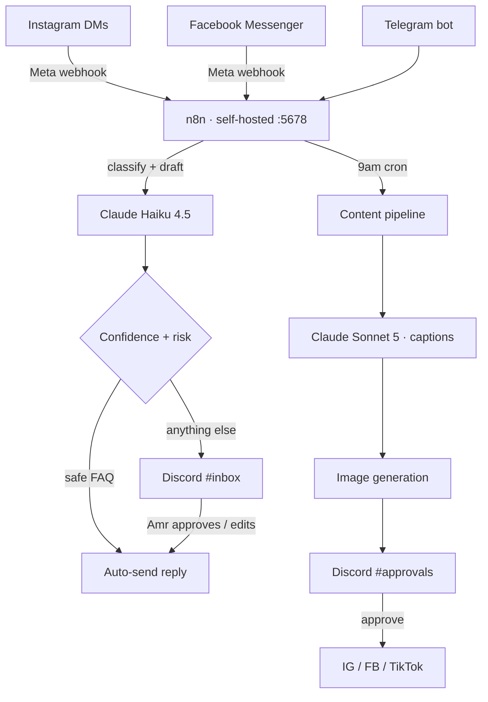

# 14 — Marketing Automation Stack

> What is actually running, what the reply bot should be, and how the content/funnel pipeline gets built. Verified against the live server on 2026-07-26.

Related: [11-n8n-social-workflow.md](11-n8n-social-workflow.md) · [13-accounts-and-identity.md](13-accounts-and-identity.md) · [07-content-calendar.md](07-content-calendar.md)

---

## Ground truth: what is running right now

| Component | State | Detail |
|---|---|---|
| n8n | ✅ **Running** | Docker container `swingby-n8n`, image `docker.n8n.io/n8nio/n8n`, port `5678`, up 27h |
| n8n workflows | ⚠️ **One** | `Morning Brief — SwingBy`, active, last updated 2026-07-20 |
| n8n credentials store | ❌ **Empty** | No stored credentials. Telegram works off container env vars, not the credential vault. |
| Telegram bot | ✅ **Live** | `TELEGRAM_BOT_TOKEN` + `TELEGRAM_CHAT_ID` in the container env |
| Brain mount | ✅ | `~/brain` → `/data/brain` (read-only), `swingby/` → `/data/swingby` (read-only) |
| Transactional email | ✅ **Wired end to end** | `RESEND_API_KEY` in `backend/.env`; `swingbyy.com` verified at Resend (`resend._domainkey` + `send.swingbyy.com` with bounce MX). Sender is `hello@swingbyy.com`. |
| Discord | ❌ Not set up | No server, no bot, nothing on the box |
| Local LLM | ❌ Not installed | No Ollama, no model weights — and see the hardware verdict below |

### Correction to doc 11

[11-n8n-social-workflow.md](11-n8n-social-workflow.md) describes three workflows as "**as built**" on an n8n Cloud instance at `https://alkubati.app.n8n.cloud`, with workflow IDs. **That instance returns 404 and those workflows do not exist** — not on n8n Cloud, and not in the self-hosted instance (which has exactly one workflow). n8n Cloud is $20/mo and we are on the free path for everything until launch.

What *is* real: the workflow JSON files on disk in `marketing/workflows/` are genuine and importable. Treat doc 11 as a **design spec for work not yet done**, not a record of running infrastructure. Two further mismatches to fix when importing them:

- They post approval gates to **Slack**. We use **Telegram** (live) and will use **Discord**. Swap the nodes.
- They call **OpenAI GPT-4o** for caption generation. Swap to Claude (below) — better copy, and we're not adding a second AI vendor and a second bill.

---

## The reply bot: don't self-host a model

The plan was to download a small LLM onto the server and drive it through Hermes. **The box can't run one usefully.** Measured:

| Resource | Actual |
|---|---|
| CPU | 4 cores |
| RAM | **3 GB total, ~1 GB available** (n8n holds the rest) |
| GPU | **None** — no `nvidia-smi`, no CUDA |
| Disk | 66 GB free (the only resource we have spare) |

A 7B model at Q4 needs ~5 GB of RAM — five times what's free. A 3B needs ~2 GB, still more than we have. A 1.5B would technically load and would produce customer-facing DM replies bad enough to cost us signups, at maybe 2–5 tokens/sec on four CPU cores with no GPU, while starving n8n. Self-hosting here is not a cost saving; it's a worse product for more work.

### Use Claude Haiku 4.5 via API

Model ID: **`claude-haiku-4-5`**. Pricing: **$1.00 per million input tokens, $5.00 per million output**, 200K context.

A DM auto-reply is a small call — say 1,500 input tokens (system prompt + business context + the incoming message) and 200 output:

| Volume | Monthly cost |
|---|---|
| 500 DMs | ~$1.25 |
| 2,000 DMs | ~$5.00 |
| 10,000 DMs | ~$25.00 |

At launch volumes this is **a couple of dollars a month** for replies that are actually good enough to send. Cheaper than the electricity of running a bad model locally, and it frees the 1 GB of RAM for n8n. Use prompt caching on the system prompt and the numbers drop further.

Use a bigger model (`claude-sonnet-5`) only for the content-generation workflow, where quality compounds and volume is ~30 calls/month. Reply triage stays on Haiku.

**The 66 GB of free disk is still useful** — that's where generated images, video renders, and the content archive live. Storage we have; compute we don't.

---

## Architecture

### Why Discord as the console

Telegram is already live and is the right channel for **push** — the morning brief, alerts, one-tap commands. Discord is better as the **workspace**: separate channels for separate concerns, threads on individual items, buttons and slash commands, and a scrollback that isn't one flat conversation.

Suggested channels:

| Channel | Contents |
|---|---|
| `#inbox` | Incoming DMs the bot escalated, with the drafted reply and Approve/Edit/Ignore buttons |
| `#approvals` | Tomorrow's posts — caption + image — approve before the 9am send |
| `#alerts` | Prod health, failed workflows, Stripe/webhook errors |
| `#metrics` | Nightly engagement pull, weekly KPI roll-up |
| `#ideas` | Amr drops a voice note or a link; the bot turns it into a content brief |

Two ways to wire it, in order of preference:

1. **n8n Discord node + webhooks.** No new service on the box, no new process to babysit. Covers post-to-channel and inbound slash commands via webhook. This is the right starting point.
2. **A small Discord bot process** (discord.py or discord.js, ~80 MB RSS) only if we need persistent interactive components n8n can't express. Adds a process to keep alive on a box with 1 GB free — hold off until n8n proves insufficient.

### Reply-bot guardrails — the part that matters

An auto-replier on a marketplace is a liability if it's ungated. Hard rules for the classifier prompt:

- **Never quote a price, promise a timeline, or commit a business to a job.** Those are contractual.
- **Never discuss a specific booking, dispute, or payment.** Escalate every one, unread.
- **Auto-send only these categories:** "how does it work", "is it free for clients", "what areas do you cover", "how do I sign up as a business", "where's the app". Everything else goes to `#inbox`.
- **Always disclose it's automated** on the first reply, with a route to a human: *"(Auto-reply — Amr will follow up personally if you need more.)"*
- **Rate-limit per sender** so a loop can't spam anyone.
- **Log every message and every reply** to Supabase. When something goes wrong we need the transcript.

Meta's Instagram/Messenger DM API also requires the account be a **Business account connected to a Facebook Page**, with `instagram_manage_messages` permission and App Review — that's a multi-day approval, so start it early. Until it clears, the bot reads a Telegram-forwarded copy and drafts replies for manual paste.

---

## Funnel and image pipeline

### Funnel modelling — don't buy a funnel tool

A funnel is a spreadsheet with a diagram, until it has traffic. The stages, mapped to what SwingBy already measures in [08-kpis-and-metrics.md](08-kpis-and-metrics.md):

| Stage | Instrument | Where the number comes from |
|---|---|---|
| Reach | Impressions | Nightly engagement pull → Supabase |
| Click | Bio-link + ad clicks | Cloudflare Web Analytics (free, no cookie banner) |
| Signup | Account created | Supabase `users` |
| Activate | Job posted / business profile completed | Supabase `service_posts`, `businesses` |
| Transact | First booking paid | Supabase `bookings` |
| Repeat | Second booking | Supabase `bookings` |

Build it as **one n8n workflow that writes a daily row to a Supabase `funnel_daily` table**, and one Discord/Telegram card that prints the six numbers and the conversion between each. That is the whole funnel product. Diagram it in the vault with Mermaid — Obsidian renders those natively — and skip the SaaS.

### Image and creative generation

Three tiers, cheapest first:

| Tier | Tool | Cost | Use for |
|---|---|---|---|
| Templated | HTML + CSS rendered headless to PNG on the server | **$0** | Business spotlights, quote cards, before/after frames, stat cards — anything with a repeating layout. Headless Chromium already runs on this box without sudo, and 66 GB of disk to store output. |
| Generated | An image API called from n8n | ~$0.04/image | Concept art, seasonal/trend tie-ins, ad creative variants |
| Real | Photos of actual Calgary jobs | Time only | **The highest-performing content by a distance.** [12-social-media-playbook.md](12-social-media-playbook.md) is explicit: stock photos don't work. |

The templated tier does most of the volume and costs nothing — a Docker step that takes a JSON row (business name, category, rating, photo URL), renders an HTML template through headless Chromium, and drops a PNG on disk for the posting workflow to pick up. Build that before paying for image generation.

**Do not build a Docker image-generation pipeline before there is content to generate.** The pipeline is a week of work that produces zero customers on its own.

---

## Cost summary

| Line item | Monthly |
|---|---|
| n8n (self-hosted, existing box) | $0 |
| Claude Haiku 4.5 — DM replies (~2k/mo) | ~$5 |
| Claude Sonnet 5 — content generation (~30 calls) | ~$2 |
| Templated image rendering | $0 |
| Generated images (~20/mo, optional) | ~$1 |
| Cloudflare (DNS, email routing, analytics) | $0 |
| Resend (free tier: 3k emails/mo — already verified) | $0 |
| Domain defensive registrations | ~$2 amortised |
| **Total** | **~$10/mo** |

Ads are separate and deliberately excluded — see [11b-ads-plan.md](11b-ads-plan.md). The infrastructure to run marketing costs about ten dollars a month. That is the point of this design.

---

## Build order

Sequenced so each phase is independently useful and nothing is built before it's needed.

| Phase | Build | Gate |
|---|---|---|
| **0** | Accounts + mailboxes ([13](13-accounts-and-identity.md)). ~2 hours, mostly clicking. | Do now — handles get squatted |
| **1** | Import the three JSON workflows into the self-hosted n8n; swap Slack→Discord, OpenAI→Claude; run with the approval gate on and auto-post **off** | After M1 |
| **2** | Templated image renderer (HTML→PNG via headless Chromium) | With phase 1 |
| **3** | DM triage on Haiku 4.5, escalate-everything mode (nothing auto-sends) | After Meta App Review starts |
| **4** | Turn on auto-send for the five safe FAQ categories only | After 2 weeks of clean phase-3 logs |
| **5** | `funnel_daily` table + the six-number daily card | When there's traffic to count |

**Phase 0 is the only one worth doing before the product can take a payment.** Everything from phase 1 on is a machine for distributing content about a product that a stranger still can't sign up for and pay — the M1 gate and the app-wide walkthrough audit come first. Building the distribution machine early feels like progress and isn't.
