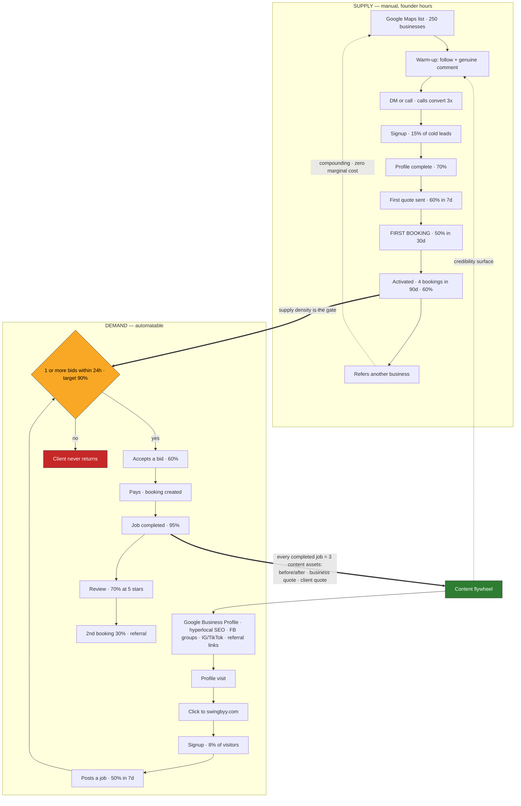
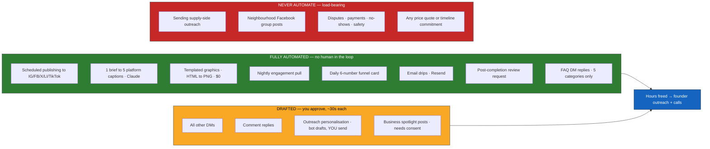

# 16 — Funnel Map

> How social media actually feeds SwingBy, drawn as two funnels instead of one. Built 2026-07-28 from the marketing folder as it stands.

Related: [11c-customer-acquisition.md](11c-customer-acquisition.md) · [08-kpis-and-metrics.md](08-kpis-and-metrics.md) · [14-automation-stack.md](14-automation-stack.md) · [15-tips-and-workarounds.md](15-tips-and-workarounds.md)

---

## Why two funnels

The two sides of the marketplace are won by opposite tactics, so a single funnel diagram would lie about both.

| | Supply — businesses | Demand — clients |
|---|---|---|
| Won by | Direct outreach. Phone, DM, in person. | Content, local SEO, referral, paid |
| Social's role | **Credibility check only.** A business owner Googles "is SwingBy legit" and finds something real. A 10-post bar, not a 1,000-follower bar. | The actual acquisition channel |
| Automatable? | **No.** See [15-tips-and-workarounds.md](15-tips-and-workarounds.md) — 250 owners in one city who talk to each other. One automated blast burns the market. | Yes, nearly end to end |
| First 50 | 50 conversations | Comes free once supply exists |

Per [15](15-tips-and-workarounds.md): *the first 250 businesses will not come from Instagram.*

---

## The map

---

## The chokepoint

**`Posts a job → at least 1 bid within 24h`.** Target is 90% ([08](08-kpis-and-metrics.md)).

A client who posts and gets zero bids never comes back, and social media cannot fix that — only supply density can. Every hour of demand-side content spent before that gate is clear burns the top of the funnel it was meant to fill.

Practical rule from [15](15-tips-and-workarounds.md): **never drive client demand into a category with fewer than ~5 active businesses.** Launch categories one at a time.

---

## Instrumentation

Six numbers, one daily row in a Supabase `funnel_daily` table, one card pushed to Telegram. That is the whole funnel product — no SaaS ([14](14-automation-stack.md)).

| Stage | Instrument | Source |
|---|---|---|
| Reach | Impressions | Nightly engagement pull → Supabase |
| Click | Bio-link + ad clicks | Cloudflare Web Analytics — free, no cookie banner |
| Signup | Account created | Supabase `users` |
| Activate | Job posted / business profile complete | Supabase `service_posts`, `businesses` |
| Transact | First booking paid | Supabase `bookings` |
| Repeat | Second booking | Supabase `bookings` |

---

## Automation overlay

The five auto-send DM categories, and nothing else: how it works · is it free for clients · what areas we cover · how to sign up as a business · where's the app. Everything else escalates unread. Guardrails in [14](14-automation-stack.md).

---

## Time budget

The point of the machine is to move hours from content ops to outreach.

| | Today, as written | After automation |
|---|---|---|
| Content production | ~6 h/wk ([07](07-content-calendar.md)) | ~0 — 240 posts already drafted in `content-library/` |
| Publishing + scheduling | manual | 0 — n8n cron |
| DM + comment replies | 2h SLA across 5 platforms | ~1.5 h/wk of approvals |
| **Left for outreach** | little | **the evening** |

Caveat: [12-social-media-playbook.md](12-social-media-playbook.md) commits to 17 posts/week across 7 platforms while its own principle #2 says one platform at a time. At launch, run **Instagram + Facebook + Google Business Profile** only. Adding platforms adds approval load, not customers.

---

## Build order

From [14-automation-stack.md](14-automation-stack.md), with one change.

| Phase | Build | Gate |
|---|---|---|
| **0** | Accounts + mailboxes ([13](13-accounts-and-identity.md)). ~2 h of clicking. Start Meta App Review the same day — it takes days. | **Do now** — handles get squatted |
| **1** | Import the 3 workflow JSONs; swap Slack→Telegram/Discord and OpenAI→Claude; approval gate on, auto-post **off** | After M1 |
| **1b** | `funnel_daily` table + the six-number daily card | **Moved forward** — without it you run content blind to which stage leaks |
| **2** | Templated image renderer, HTML→PNG | With phase 1 |
| **3** | DM triage, escalate-everything mode | After Meta App Review starts |
| **4** | Auto-send for the 5 safe FAQ categories | After 2 weeks of clean phase-3 logs |

Phase 0 is the only piece worth doing before the product can take a payment. Everything from phase 1 on distributes content about a product a stranger still can't sign up for and pay — the M1 gate and the walkthrough audit come first.

---

## Open items this map surfaced

1. **Google Business Profile is under-weighted.** Free, highest-intent local surface, feeds the 50-page SEO campaign — and it's missing from the channel tables in [06](06-growth-playbook.md) and [12](12-social-media-playbook.md). For a Calgary marketplace it likely beats Instagram reach outright.
2. **No analytics below the click.** Cloudflare Web Analytics isn't installed, so `Click → Signup` is currently unmeasurable.
3. **Model access for n8n.** The AI nodes need an Anthropic **API key** — a Pro subscription can't authenticate them. The subscription route is shelling out to Claude Code headless from an Execute Command node. Decision pending; see the note in [14](14-automation-stack.md).
